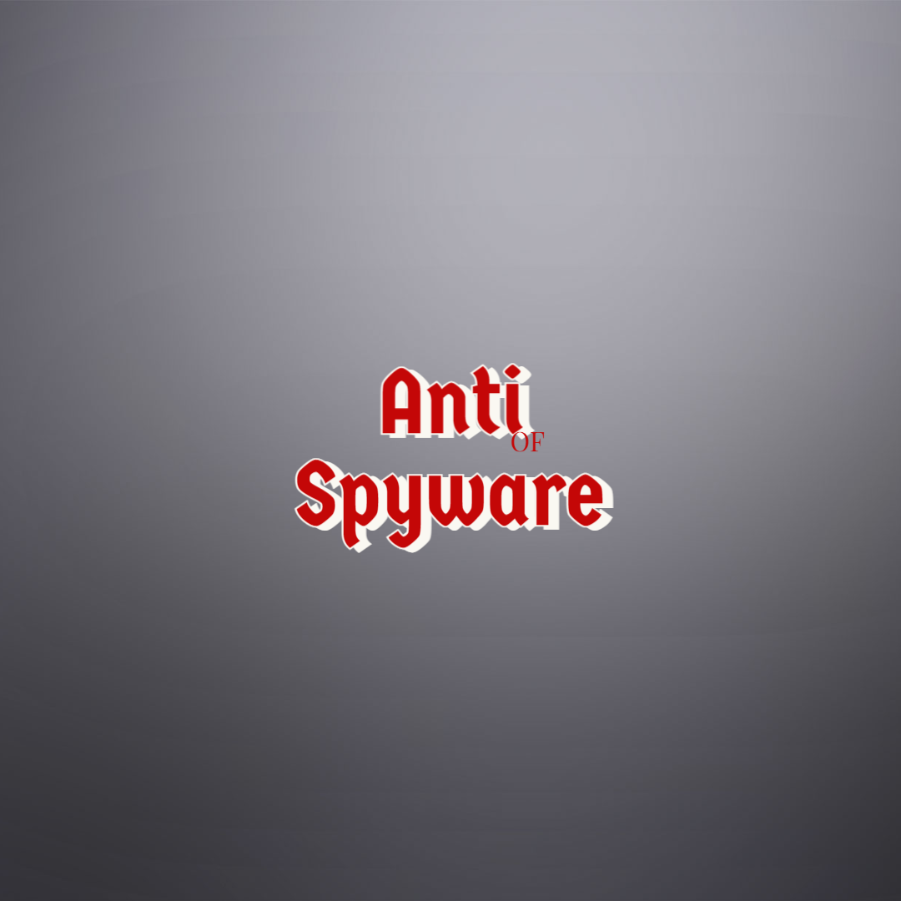
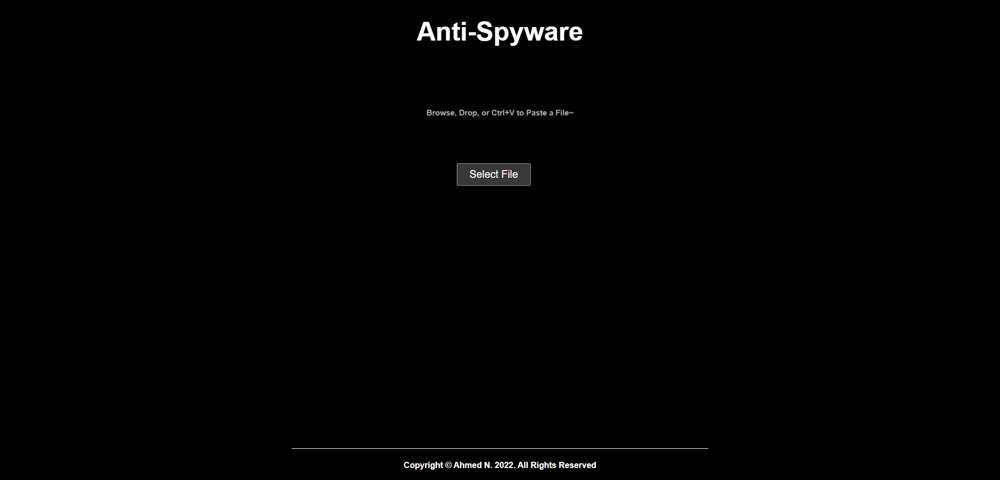
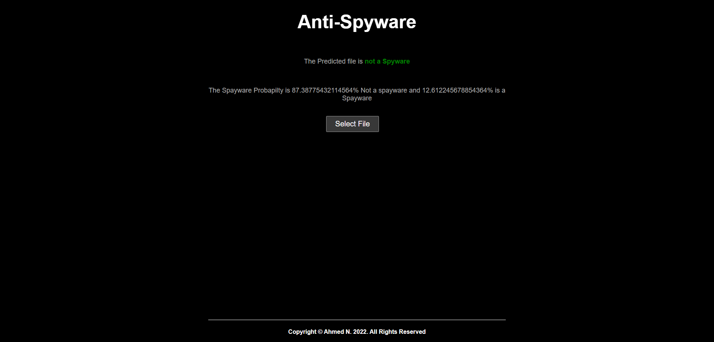
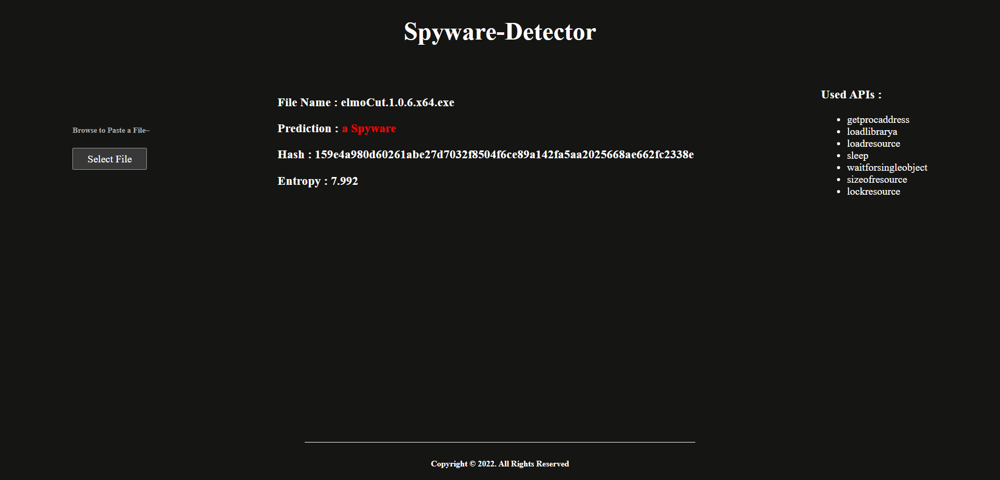

<h1 align="center">Spyware Detector</h1><p align="center">It's a Spyware Detector Website <b>Powered by Machine Learning</b> <br></p>




[](https://github.com/ahmednss/spyware-detector/fork)

---

## Installation Steps

Open CMD where you want to clone the project & run the following commands

```
git clone https://github.com/Ahmed-nd/spyware-detector.git
cd src/python-script/
pip install -r requirements.txt
python server.py
```

---

## Gallery

|  Screenshots    |
|:----:|
|  |
|  |
|  |

---

## **To-Do List and New Features**

### **1. Major Architectural Changes**
#### **Transition from Flask to TypeScript**
- [ ] **Set Up a TypeScript Backend**:
  - Choose a framework (e.g., Express.js, NestJS, or Fastify).
  - Initialize a new TypeScript project with `tsc` and `ts-node`.
  - Set up ESLint and Prettier for code quality.
- [ ] **Refactor the File Upload Service**:
  - Rewrite the Flask file upload logic in TypeScript.
  - Use middleware like `multer` for handling file uploads.
  - Validate file types and sizes using TypeScript interfaces.
- [ ] **Rewrite the File Analysis Script**:
  - Convert the Python file analysis script to TypeScript.
  - Use Node.js libraries (e.g., `fs`, `path`) for file handling.
  - Ensure the script is modular and reusable.

---

### **2. Security Enhancements**
#### **Object-Oriented Security**
- [ ] **Isolate the Scanning Process**:
  - Use Docker containers to run the file analysis script in a sandboxed environment.
  - Implement virtual machines (VMs) for additional isolation if needed.
- [ ] **Encrypt Data**:
  - Use AES encryption for files during upload and storage.
  - Implement HTTPS (TLS/SSL) for secure communication.
- [ ] **Authentication and Authorization**:
  - Add JWT-based authentication for API endpoints.
  - Implement role-based access control (RBAC) for different user roles.
- [ ] **Input Validation**:
  - Use TypeScript interfaces and validation libraries (e.g., `zod` or `class-validator`) to validate user inputs.
  - Sanitize file names and metadata to prevent injection attacks.

---

### **3. Scalability and Performance**
#### **Asynchronous and Distributed Systems**
- [ ] **Containerize the Application**:
  - Create a `Dockerfile` for the TypeScript backend.
  - Use `docker-compose` to orchestrate the backend, database, and scanning service.
- [ ] **Load Balancing**:
  - Set up NGINX or HAProxy as a load balancer for the backend.
  - Deploy multiple instances of the backend for horizontal scaling.
- [ ] **Asynchronous Processing**:
  - Use a message broker (e.g., RabbitMQ or Redis) to handle file scanning tasks asynchronously.
  - Implement a task queue system for processing large files.
- [ ] **Optimize ML Model Integration**:
  - Use TensorFlow.js or ONNX.js to run the ML model directly in the Node.js environment.
  - Cache model predictions for frequently scanned files.

---

### **4. Code Refactoring and Restructuring**
#### **Modular and Maintainable Code**
- [ ] **Modularize the Code**:
  - Break down the backend into smaller, reusable modules (e.g., `upload`, `scanning`, `auth`, `utils`).
  - Use dependency injection for better testability and maintainability.
- [ ] **Improve Error Handling**:
  - Add proper exception handling for file uploads, scanning, and ML model predictions.
  - Log errors for debugging and monitoring.
- [ ] **Add Unit and Integration Tests**:
  - Write unit tests for all modules using `Jest` or `Mocha`.
  - Add integration tests for API endpoints and file scanning workflows.
- [ ] **Document the Code**:
  - Add docstrings and comments to explain the functionality of each module.
  - Create a `docs` folder for detailed documentation.

---

### **5. Monitoring and Metrics**
#### **System Health and Performance**
- [ ] **Set Up Monitoring**:
  - Use Prometheus to collect system metrics (e.g., upload success rate, scanning time).
  - Visualize metrics using Grafana.
- [ ] **Logging**:
  - Use a logging library (e.g., `winston` or `bunyan`) to log system activity and errors.
  - Centralize logs using the ELK Stack (Elasticsearch, Logstash, Kibana).
- [ ] **Alerting**:
  - Set up alerts for critical system failures (e.g., scanning service downtime).
  - Use tools like PagerDuty or Opsgenie for incident management.

---

### **6. New Features**
#### **Enhance User Experience and Functionality**
- [ ] **Real-Time Scanning Progress**:
  - Add WebSocket support for real-time progress updates during file scanning.
- [ ] **User Dashboard**:
  - Build a user dashboard to view scan history and results.
  - Use a frontend framework like React or Angular.
- [ ] **Support for Multiple File Types**:
  - Extend the file analysis script to handle different file types (e.g., PDFs, images, executables).
- [ ] **Add New Scanning Engines**:
  - Integrate additional scanning engines (e.g., ClamAV, YARA) for better threat detection.

---

### **7. Deployment and CI/CD**
#### **Automate Deployment and Testing**
- [ ] **Set Up CI/CD Pipeline**:
  - Use GitHub Actions or GitLab CI/CD to automate testing and deployment.
  - Add linting, testing, and build steps to the pipeline.
- [ ] **Deploy to Cloud**:
  - Deploy the application to a cloud provider (e.g., AWS, GCP, or Azure).
  - Use Kubernetes for container orchestration if needed.
- [ ] **Environment Configuration**:
  - Use environment variables for configuration (e.g., API keys, database credentials).
  - Store sensitive data in a secrets manager (e.g., AWS Secrets Manager or HashiCorp Vault).

---

### **8. Documentation and Onboarding**
#### **Make the Project Accessible**
- [ ] **Update README.md**:
  - Add a clear description of the project, its features, and how to set it up.
  - Include a section for contributors with guidelines for code style and testing.
- [ ] **Add API Documentation**:
  - Use Swagger or Postman to document the API endpoints.
  - Provide examples for file upload and scanning workflows.
- [ ] **Create a Contribution Guide**:
  - Add a `CONTRIBUTING.md` file to guide new contributors.
  - Include steps for setting up the development environment and running tests.

---

### **Ordered List (From Most Difficult to Easiest)**
1. **Transition from Flask to TypeScript**:
   - Set up a TypeScript backend and rewrite the file upload service.
2. **Security Enhancements**:
   - Isolate the scanning process, encrypt data, and implement authentication.
3. **Scalability and Performance**:
   - Containerize the app, set up load balancing, and implement asynchronous processing.
4. **Code Refactoring and Restructuring**:
   - Modularize the code, improve error handling, and add tests.
5. **Monitoring and Metrics**:
   - Set up monitoring, logging, and alerting.
6. **New Features**:
   - Add real-time scanning progress, a user dashboard, and support for multiple file types.
7. **Deployment and CI/CD**:
   - Automate deployment and testing using CI/CD pipelines.
8. **Documentation and Onboarding**:
   - Update the README, add API documentation, and create a contribution guide.


If you liked the repo then kindly support it by giving it a star ⭐!


## License

Copyright (c) 2022 Ahmed N.

