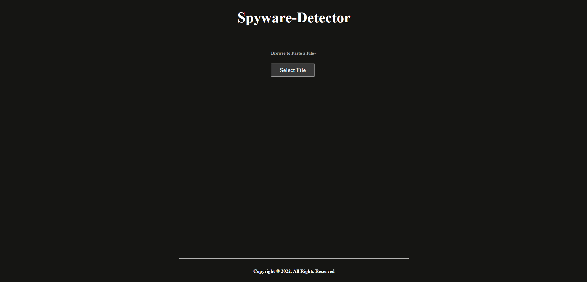
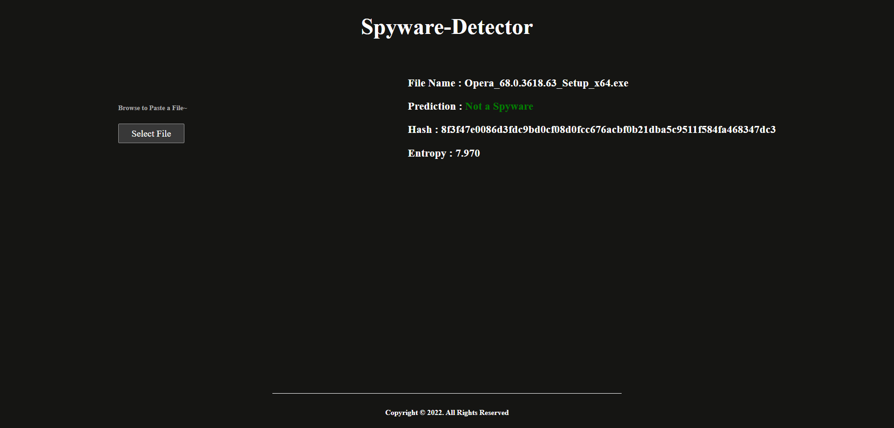
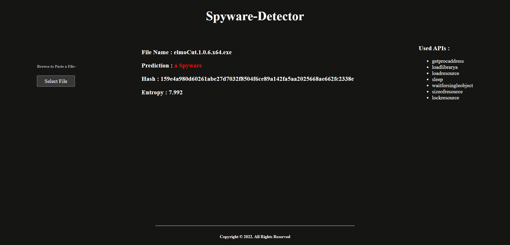

<h1 align="center">Spyware Detector</h1><p align="center">It's a Spyware Detector Website <b>Powered by Machine Learning</b> <br></p>


[](https://github.com/ahmednss/spyware-detector/fork)

---

## Installation Steps

Open CMD where you want to clone the project & run the following commands

```
git clone https://github.com/Ahmed-nd/spyware-detector.git
cd src/python-script/
pip install -r requirements.txt
python server.py
```

---

## Gallery

|  Screenshots    |
|:----:|
|  |
|  |
|  |

---

## **📌 To-Do List: Migration & Enhancements**  

### **1️⃣ Migrate from Flask to TypeScript (🚀 Major Task)**
- [ ] Set up a new backend using TypeScript with Express.js or Fastify  
- [ ] Implement TypeScript types for API requests, responses, and database models  
- [ ] Replace Python-based file handling logic with TypeScript equivalents  

### **2️⃣ Implement Secure & Isolated File Scanning**  
- [ ] Run file scanning inside an isolated environment (Docker, Firecracker)  
- [ ] Integrate open-source sandboxing (e.g., Cuckoo Sandbox)  
- [ ] Ensure proper access control for uploaded files  

### **3️⃣ Scalable File Processing & Storage**  
- [ ] Implement a queue-based processing system (RabbitMQ/Kafka)  
- [ ] Support large file uploads with chunked/resumable uploads  
- [ ] Store files in MinIO or a distributed file system  

### **4️⃣ ML Model Integration & Optimization**  
- [ ] Convert Python-based ML integration to TypeScript-compatible services  
- [ ] Optimize the ML model for real-time analysis  
- [ ] Implement model versioning and update mechanisms  

### **5️⃣ Multi-Layered Virus Scanning**  
- [ ] Integrate ClamAV/YARA for signature-based scanning  
- [ ] Add ML-based detection for heuristic analysis  
- [ ] Implement multi-engine scanning workflow  

### **6️⃣ Security & API Hardening**  
- [ ] Implement file validation to prevent malicious uploads  
- [ ] Add API authentication & rate limiting (JWT, OAuth, API keys)  
- [ ] Implement role-based access control (RBAC)  

### **7️⃣ Monitoring & Failure Handling**  
- [ ] Implement system health checks with Prometheus + Grafana  
- [ ] Track scanning failures and implement retry mechanisms  
- [ ] Log API and scanning activity for auditing  

### **8️⃣ API & Documentation Improvements**  
- [ ] Document API endpoints using OpenAPI (Swagger)  
- [ ] Write unit and integration tests for backend stability  
- [ ] Improve README with setup instructions and examples  

---

If you liked the repo then kindly support it by giving it a star ⭐!


## License

spyware-detector is [MIT licenced](LICENSE.md)
